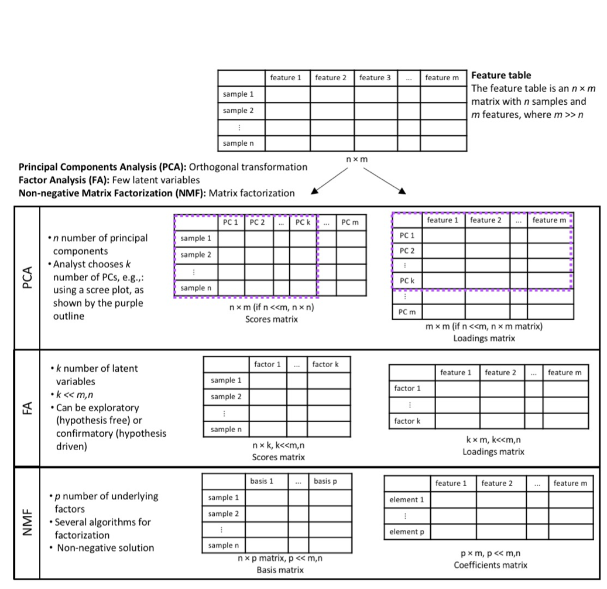

Dimensionn reduction is often used in omics data analysis. While the excerpt below relates to dimension reduction in the context of high-resolution mass spec data, here are other resources  you  can  use for  understanding dimension reduction:  

*  [Mailman: PCA](https://www.mailman.columbia.edu/research/population-health-methods/principal-components-analysis)  
*  [Stanford: multivariate analysis](http://web.stanford.edu/class/bios221/PCA_Slides.html)  

*Taken from Kalia et al, Unsupervised dimensionality reduction for exposome research, under review, 2020*

"Exposomic data from HRMS are high-dimensional and complex. When untargeted methods are used to characterize the exposome, the number of chemical signals can be greater than 100,000 [@vermeulen_exposome_2020]. These data tables represent the primary input for bioinformatic and biostatistical analysis to evaluate biological meaning and to determine exogenously derived chemicals that may be of relevance to an outcome of interest. Since detected analytes are not annotated a priori, the results from HRMS contain information on each detected ion (a feature). Each feature is characterized by its mass-to-charge ratio, the retention time at which the compound eluted from the chromatographic column, and its abundance in the sample. Some features may arise from the same parent compound but during ionization may lead to formation of multiple ions with different masses with the same retention times. Therefore, the feature table may contain degenerate features which will be highly correlated since they arise from the same parent compound. Thus, correlation is present not only due to exposure sources and biological processes, but also arises from the analysis itself [@alonso_analytical_2015]. This forces researchers to deal with the “curse of dimensionality” and to capture the essence of the data generated [@bellman_dynamic_1966]. Given the high correlations across chemical exposures, single chemical association studies are not appropriate, with implications for health that are missed using a “candidate” approach. Furthermore, high correlation compounds correction for multiple testing, decreasing study power and inflating the potential for false negatives.  

Data dimensionality reduction approaches produce a manageable number of variables, allow for better visualization, remove redundant and uninformative variables, and reduce computational burden [@xue_cell-based_2004]. Several techniques have been described that reduce the size of the data table while minimizing loss of information, describing the essence of the data generated. These include unsupervised and supervised methods. In supervised methods, the outcome of interest informs the dimensionality reduction solution. These methods are used for feature selection and include—but are not limited to—different forms of penalized regression: least absolute shrinkage and selection operator (LASSO) [@tibshirani_regression_1996], ridge regression [@hoerl_ridge_1970], and elastic net regression [@zou_regularization_2005], and different modifications of partial least squares regression [@le_cao_sparse_2011, @nguyen_tumor_2002]. Unsupervised methods do not take the outcome of interest under consideration during feature extraction. The goal in unsupervised dimensionality reduction is to discover the underlying structure in the data. These methods are tuned for pattern recognition that can aid in data visualization, data exploration, and uncovering latent variables. A popular method for unsupervised linear transformation of data is principal components analysis. Different unsupervised methods also exist for non-linear data transformations [@bartenhagen_comparative_2010] like the kernel PCA [@smola_advances_1999], isomap [@tenenbaum_global_2000] and autoencoders [@kingma_auto-encoding_2014].   

#### Principal components analysis (PCA)
Principal components analysis is one of the most commonly used approaches for dimensionality reduction. The method uses an orthogonal transformation to convert a set of observations of possibly correlated variables into a set of linearly uncorrelated variables called principal components. The first component explains the most variance in the data and each succeeding component has the highest variance possible under the constraint that it is orthogonal, i.e., independent, to the preceding components [@jolliffe_principal_2002]. The method does not reduce the number of variables, m variables produce m components. The analyst chooses the number of components to include in analyses based on some a priori defined criterion/a, e.g., looking at the scree plot, selecting components with eigenvalues above one, or selecting the number of components that explain a pre-specified proportion of the variance in the data, e.g., at least 75%. Since PCA forces orthogonality between components, it imposes a rigid structure [@liland_multivariate_2011]. The alternating least squares variant of PCA, independent component analysis, is more successful in dealing with this rigidity but has less compression in the first components [@comon_independent_1994]."   

  

*Visual representation of dimension reduction using PCA, FA, and NMF.*   

*********************

### References 
