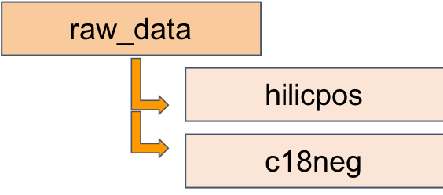

Organizing folders in  a uniform manner will  save time in the future and make it easy to find and follow up a study in the future. While creating a folder for metabolomic analysis, create just one folder for each project (eg: daf16_metabolomics). Create an R project with same name (relative pathnames, which will also be the  name of the github repository (more to come) with same name. In each parent project folder (Rproject/ repo), have subfolders for the following:  

*  raw_data  
*  code  
*  results  
*  figures  
*  manuscript/report  

**raw_data**  

Contains feature tables from the two columns along with meta data collected while extracting peaks and creating the feature table. It contains two folders:  

*  hilicpos  
*  c18neg  
	

**code**  

Contains all code files used to manipulate the data. While this is subjective to analyzer preference and the research question it may contain R (or ther language) scripts like:

*  quality_check.R  
*  exploratory_analysis.R  
*  pathway_analysis.R  
*  annotations.R  

**results**  

Contains results files. These may also be intermediate files generated during analysis. Again, this depends on the research question. It may contain files like: 

*  t_tests_daf16_n2_mcg.txt  
*  t_tests_daf16_n2_metab_mcg.txt  
*  daf16_metaboanalyst.txt  
*  daf16_imputed.txt  
*  daf16_normalized_scaled.txt  
*  daf16_normalized_boxplots.txt  
*  daf16_metaboanalyst_report (folder)  

    
**figures**  

Contains all figures generated during analysis. These can be high resolution, saved for a manuscript, poster, or presentation. Could contain files like:

*  mwas_daf16.jpeg  
*  pathway_bubbleplot_daf16.jpeg  
*  heatmap_daf16_n2.jpeg  
*  plsda_dag16_n2.jpeg  
*  total_ion_intensity_all.jpeg  
*  pca_all.jpeg  

**reports/manuscript**  

Contains all reports generated from analysis – could be output from a .rmd file. Could also contain components of a manuscript. Files and folders like:

*  daf16_mummichog_components.pdf  
*  data_analysis_method.docx  
*  data_generation_method.docx  
*  daf16_figures.pptx  

####Some considerations around organization:  
While naming files, 

*  avoid special characters (.,@,#..),   
*  avoid capitalized letters,    
*  avoid adding a space  

You may have a better way to organize your files but ensure that you adopt some rules for organization that you always follow. It might take some time to implement/ get used to but the returns in the long run are worth it.  

